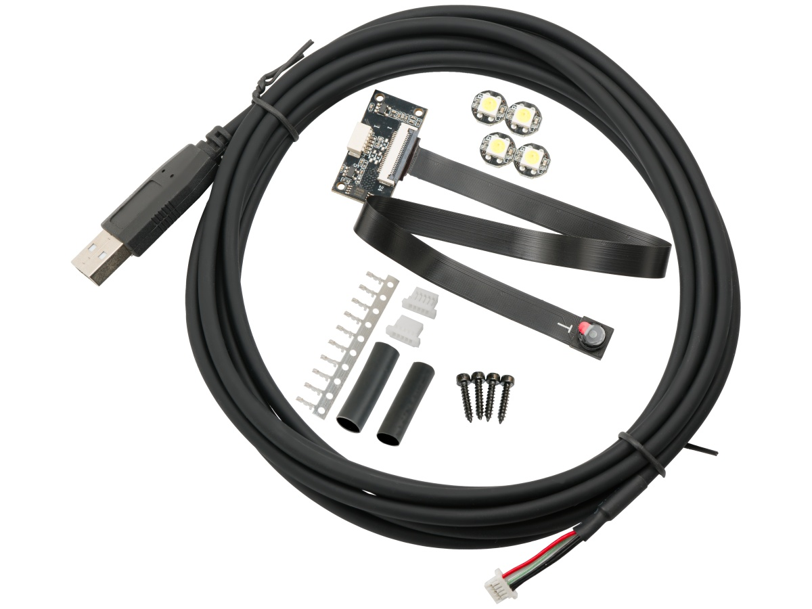
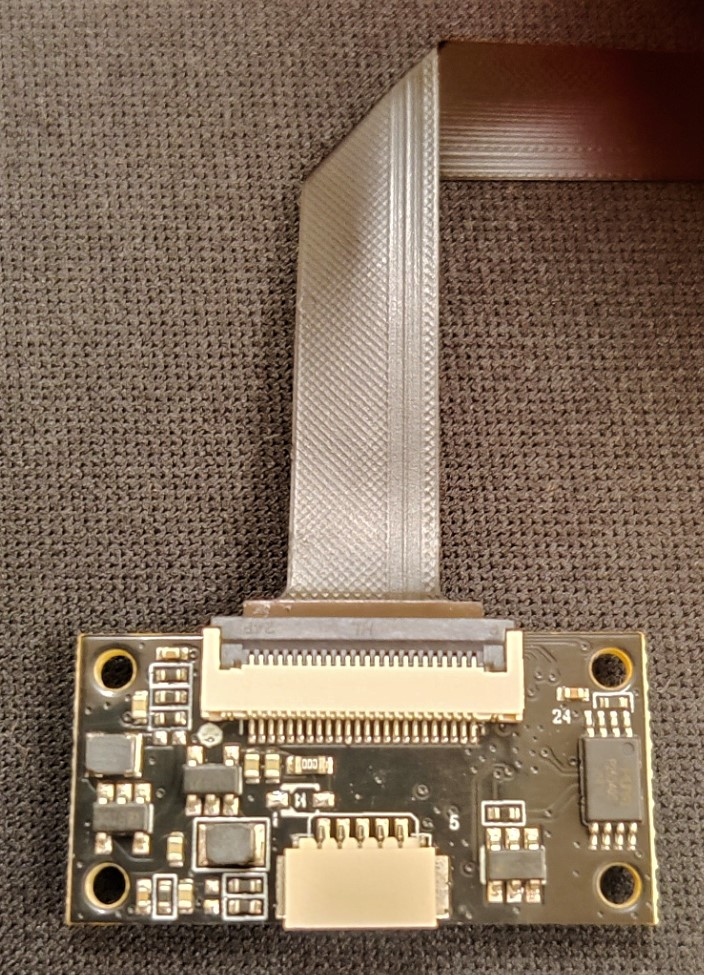

# 3DO NOZZLE CAMERA

**This repository is archived. Please visit the new project at [https://github.com/3DO-EU/Enclosure-Nozzle-Camera-V2](https://github.com/3DO-EU/Enclosure-Nozzle-Camera-V2)**

After seeing a lot of cool nozzle camera videos with hacked-up endoscopes...
We decided to make a real "Nozzle Camera" for 3D printers.
We ended up making this.
- MIPI Camera with an external USB webcam encoder (to make the camera as small as possible)
- Fixed focus lens (AF lenses start to shake and lose focus when moving fast)
- Custom FEP+Silicone USB cable, as we couldn't find any high-temperature flexible USB cables on the market.
- Custom SK6812 WWCW LED, we wanted as much light as possible while keeping the SK6812 protocol; therefore, we ended up making our LEDs similar to RGBW but with only white diodes inside.

|                         | 4K (Sony IMX258)     |
|-------------------------|----------------------|
| Sensor Size             | 1/3.06               |
| Mega-Pixel              | 13MP                 |
| Frame Rate*              | 30FPS@4K 60FPS@1080P* |
| Lens type*              | Fixed Focus          |
| FoV                     | 80Deg                |
| FPC length              | 25cm                 |
| Operating temperature** | -20°C TO 65°C        |
| Storage temperature     | -40°C TO 80°C        |

_*These frame rates represent what the camera can achieve when directly connected, such as in OBS Studio or the Windows webcam app._

_When streaming through Crowsnest on a Raspberry Pi or a similar device, two factors limit your performance: GPU power and bandwidth._

_The new version of Crowsnest supports WebRTC/H.264 streaming, significantly reducing bandwidth requirements, making it less of a concern. However, when using the WebRTC streaming function, your GPU's encoding capabilities become the limiting factor (For Raspberry Pi 4, the GPU is limited to 1080p at 38 FPS and cannot encode 4K)._

_If you opt for the MJPEG stream in Crowsnest, no encoding is necessary, eliminating GPU limitations. However, this method requires considerably more bandwidth, so your FPS will be restricted by the available network bandwidth (using an Ethernet cable instead of Wi-Fi is recommended)._

## Video

## Folders
- printers (mounts for different printers)
- hardware (CAD files to help design printer mounts)

## Pinout
PCB uses a 5P 1.0mm pitch connector.
| Pin No. | Function    | Color                |
|---------|-------------|----------------------|
| 1       | USB 5VDC    | Red                  |
| 2       | Data -      | White                |
| 3       | Data +      | Green                |
| 4       | USB -VDC/GND| Black                |
| 5       | GND/Shield  | Black (heat shrink)  |

Wire no. 5 is an optional shield/drain wire, though it will work without, we recommend installing it.

 

## Software
The camera works as a standard UVC web camera and is, therefore, compatible with Linux, Windows, and Mac.
For streaming, we recommend using [mainsail](https://github.com/mainsail-crew/mainsail) + [crowsnest](https://github.com/mainsail-crew/crowsnest).

## FAQ
- Does it work in an enclosed printer?

Yes, though our camera is rated at 60°C, we have been running it for 48 hours in a 70°C industrial heat chamber without any issues.
- Why is FPC so long?

We decided on having 25cm between the camera and PCB for more flexibility in future mount designs.
- Can I bend/fold the FPC to make it shorter?

Yes, FPC is flexible and can be bent; if you want to fold it (180 degrees), we recommend doing this max one time in the same spot, or else you risk breaking the lanes inside FPC.

Example of folding FPC

## Contributors that made this project possible
CAD Design & Testing
- Olof Ogland (Known from Bondtech)
- Kenneth Munkholt (VZ Community)
- Dennis Jespersen (From RatRig Community)

Software Development & Testing
- Meteyou (Mainsail founder)
- KwadFan (Crowsnest founder)
- Rogerlz (Crowsnest Tester)

Beta Testers
- Mitsuma (From RatRig Community)
- Joao Barros (From RatRig Community)

## Where to buy
EU / UK

USA

This work is licensed under <a href="https://creativecommons.org/licenses/by-nc-sa/4.0/?ref=chooser-v1" target="_blank" rel="license noopener noreferrer" style="display:inline-block;">CC BY-NC-SA 4.0</a>

