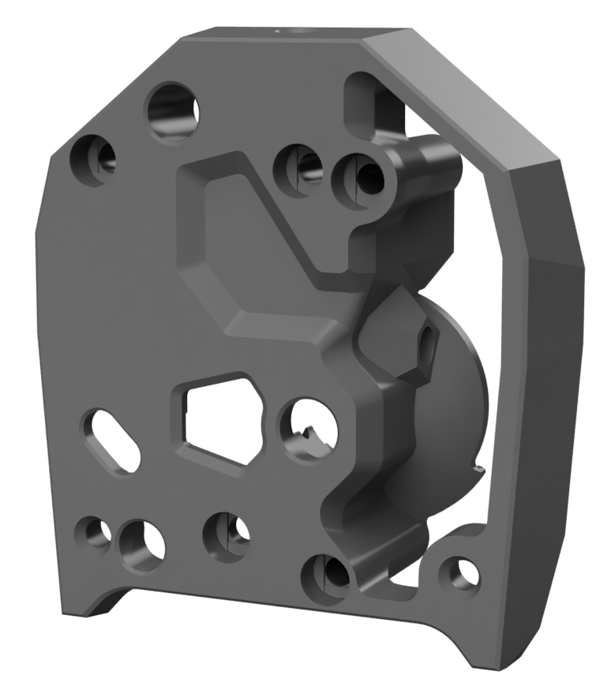
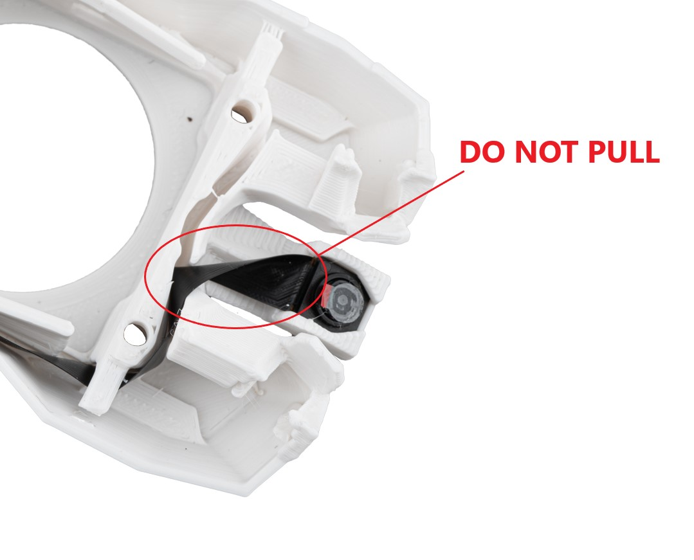
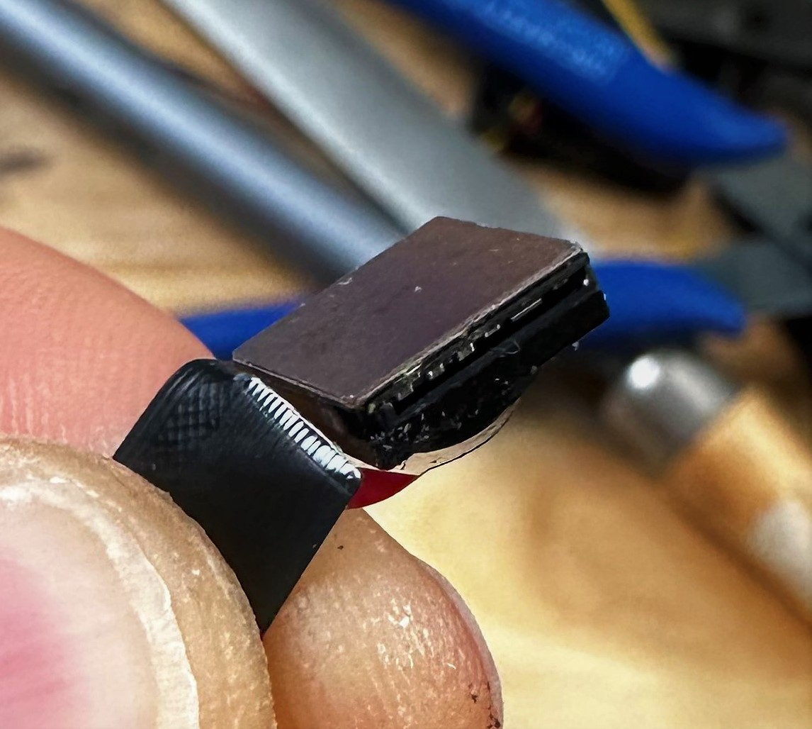

# Files for common hotends
[Standard models](./STLs/Standard/)

# Files for extended hotends (Rapido UHF / Mosquito Magnum Plus /..)
[UHF models](./STLs/UHF/)

# Other files like PCB mounts etc.
[Misc models](./STLs/Misc/)

# Pictures
  
More pictures can be found in the [Showroom](./images/Showroom/showroom.md)

# FPC Routing internal
Camera PCB can be mounted in front of the extruder using VHB tape. (Only tested with LGX Lite extruder)

It's easiest if you route FPC before led/fan wires.

- Option 1 - To the left  


- Option 2 - To the right  
  
More images [here](./images/FPC-routing/fpcrouting.md)

### CW2 main body with cutout
To make some extra room for the usb cable when using the 2-piece hartk PCB you can use this modified model with a cutout for it. The model with "_updated" in the name was updated for the July 11th 2023 update of the CW2. 




## WARNING
Do not pull to hard on the FPC, you may risk to rupture it.




# FPC Routing external
Camera PCB can be mounted using the Stealth burner adxl mount (PCB_mount_SB.stl)


# Printing instructions
 - Use normal Voron printing guidelines
    - Material: ABS
    - Layer height: 0.2mm
    - Extrusion width: 0.4mm
    - Infill type: Grid, Gyriod, Honeycomb, Triangle or Cube
    - Infill percentage: 40%
    - Wall count: 4
    - Solid top/bottom layers: 5


# Software
If you are using the standard Voron configuration with Klipper/Mainsail/Crowsnest the software configuration to add a new camera is fairly straightforward. On a Raspberry Pi4 at 800x600 resolution 30-60FPS is achievable. The focal plane is quite small so a large output resolution is not necessary.
1. Install and plug-in the 3DO nozzle camera
2. Restart the printer
3. Navigate to and view crowsnest.log to determine the video device of the new nozzle camera (~/printer_data/logs/crowsnest.log). The entry you're looking for looks something like this:
```
[03/21/23 14:14:34] crowsnest: /dev/v4l/by-id/usb-XCG-221208-J_3DO_NOZZLE_CAMERA_4K_01.00.00-video-index0 -> /dev/video2
```

4. Udate crowsnest.conf with the new device
```
[cam 2]
mode: mjpg                              # mjpg/rtsp
port: 8081                              # Port 8081 equals /webcam2/?action=[stream/snapshot]
device: /dev/video2                     # See Log for available ...
resolution: 800x600                     # widthxheight format - on a raspberry pi 4 30-60 FPS is acheivable with 800x600
max_fps: 60                             # If Hardware Supports this it will be forced, ohterwise ignored/coerced.
#custom_flags:                          # You can run the Stream Services with custom flags.
#v4l2ctl:                               # Add v4l2-ctl parameters to setup your camera, see Log what your cam is capable of.
```
5. Add your new webcam to the Mainsail UI using the endpoint for the port you selected: `/webcam2/?action=[stream/snapshot]`

If necessary, more details about configuing crowsnest can be found here: https://github.com/mainsail-crew/crowsnest


# Credits
Initial design by Olof Ogland  
Mods by Panzarkatten
