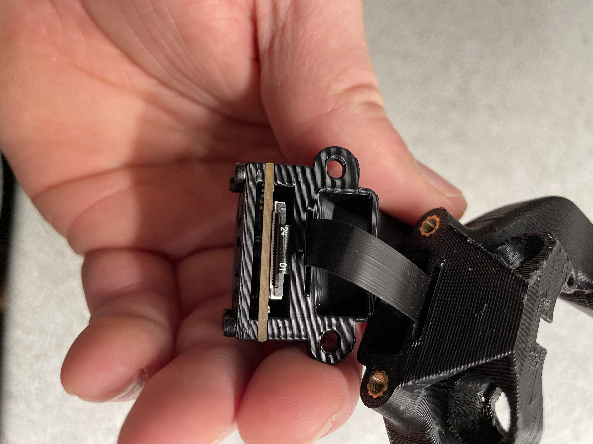
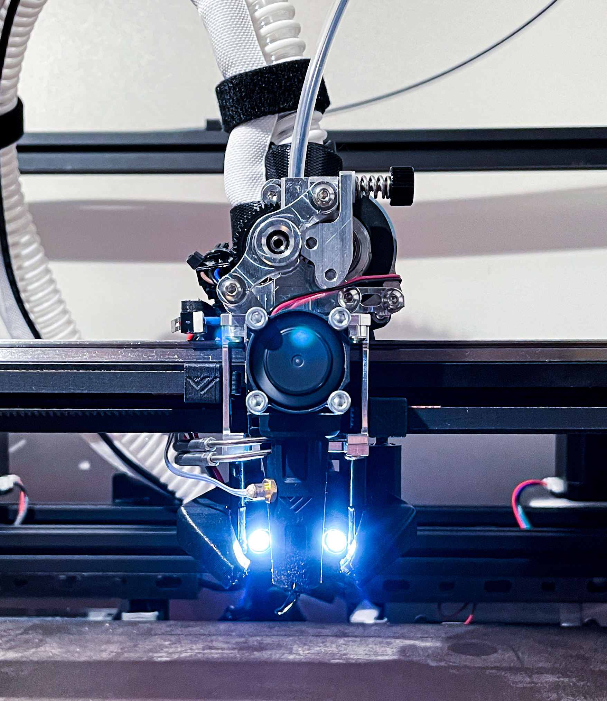

# Files needed
## For standard 5015 part cooling:
-	1 x Camduct.stl
-	2 x spacer.stl
-	1 x upper_duct.stl
-	1 x PCB_cover.stl
## For CPAP part cooling:
-	1 x Camduct.stl
-	2 x Spacer.stl
-	1 x CPAP_upper_duct.stl
-	1 x PCB_cover.stl

# Installation of the camera
Start by getting the FPC approximately halfway through the slot in the camduct. Then proceed to push the cam in place – it takes a bit of force so be carefull. Afterwards pull the FPC all the way through the slot. Make sure not to pull too hard.

Next up you need to pull the FPC through the slot in the CPAP upper duct. Make sure it is oriented correctly. Now connect the PCB tho the FPC.

Now fold up the FPC so that you end up with something like this and use the four M2x10 screws to screw on both the PCB cover and PCB. Again make sure to use caution or else you might damage the FPC.

Next step is to wire up the LED’s and push them in the LED holders. They are friction fit so they won’t fall out even at high speeds and accelerations. Then you have to mount the sub assembly to the VzPrinthead like you normally would. It can be a bit cumbersome trying to align all three parts. But you’ll soon be done. You should end up with something like this.

# Credits
Design by Kenneth Munkholt Sørensen